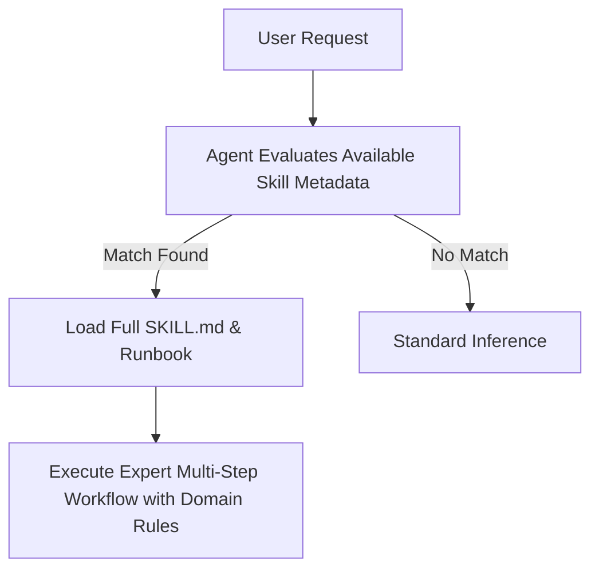

# 🧠 Agent Skills

A curated repository of production-grade, enterprise-ready **Agent Skills** designed for AI coding assistants and autonomous agents (including Google Antigravity, Gemini CLI, Claude Code, and Agentic IDEs).

Agent skills act as modular on-demand runbooks and domain knowledge packs. They equip agents with battle-tested architectures, best practices, security guardrails, and design systems without bloating prompt context windows.

---

## 📑 Table of Contents

- [Overview](#-overview)
- [Skills Catalog](#-skills-catalog)
  - [🎨 Frontend & UI/UX Design](#-frontend--uiux-design)
  - [⚙️ Backend & Cloud Architecture](#️-backend--cloud-architecture)
  - [🤖 AI & Data Systems](#-ai--data-systems)
  - [🧮 Financial & Document Systems](#-financial--document-systems)
  - [🔌 IoT & Hardware Protocols](#-iot--hardware-protocols)
  - [🧪 QA & Reliability Engineering](#-qa--reliability-engineering)
  - [🎮 Game Architecture](#-game-architecture)
  - [🛠️ Templates & Testing](#️-templates--testing)
- [Quick Start & Installation](#-quick-start--installation)
  - [Option 1: Using the Automated Installer (Recommended)](#option-1-using-the-automated-installer-recommended)
  - [Option 2: Direct Global Installation](#option-2-direct-global-installation)
  - [Option 3: Project-Level Installation](#option-3-project-level-installation)
- [How Agent Skills Work](#-how-agent-skills-work)
- [Creating & Contributing New Skills](#-creating--contributing-new-skills)
- [Repository Structure](#-repository-structure)

---

## 🚀 Overview

Skills use **progressive disclosure**. The agent only ingests the `name` and `description` frontmatter initially, loading the full skill instructions only when a relevant user prompt requires it. This keeps inference costs low and reasoning sharp.



---

## 📚 Skills Catalog

### 🎨 Frontend & UI/UX Design

| Skill Name | Purpose & Activation Scenarios | Location |
| :--- | :--- | :--- |
| [`frontend-design-mastery`](./skills/frontend-design-mastery/SKILL.md) | World-class frontend UI/UX design principles, responsive layout rules, typography hierarchies, and premium styling guidelines for modern web applications. | [skills/frontend-design-mastery](./skills/frontend-design-mastery/) |
| [`frontend-design`](./skills/frontend-design/SKILL.md) | Enterprise UI/UX design direction, component layout structures, visual hierarchy rules, color composition, and modern aesthetic guidelines. | [skills/frontend-design](./skills/frontend-design/) |
| [`design-taste-frontend`](./skills/design-taste-frontend/SKILL.md) | High-taste aesthetic guidelines, typography pairing, glassmorphic elevation, and visual polish rules from agentic-awesome-skills. | [skills/design-taste-frontend](./skills/design-taste-frontend/) |
| [`react-best-practices`](./skills/react-best-practices/SKILL.md) | Production-grade React 18 component patterns, hooks optimization, lazy-loading, suspense boundaries, and DOM sanitization. | [skills/react-best-practices](./skills/react-best-practices/) |
| [`pwa-offline-resilience`](./skills/pwa-offline-resilience/SKILL.md) | Progressive Web App (PWA) engineering, Service Worker lifecycle, Workbox caching strategies, Web Push feature detection, and offline IndexedDB state. | [skills/pwa-offline-resilience](./skills/pwa-offline-resilience/) |
| [`tailwind-patterns`](./skills/tailwind-patterns/SKILL.md) | Best practices for composing maintainable, responsive, high-performance Tailwind CSS utility classes and design tokens. | [skills/tailwind-patterns](./skills/tailwind-patterns/) |

### ⚙️ Backend & Cloud Architecture

| Skill Name | Purpose & Activation Scenarios | Location |
| :--- | :--- | :--- |
| [`nodejs-backend-architecture`](./skills/nodejs-backend-architecture/SKILL.md) | Enterprise Node.js and Express backend architecture, asynchronous hot-path optimizations, memory leak prevention, and resilient connection pooling. | [skills/nodejs-backend-architecture](./skills/nodejs-backend-architecture/) |
| [`supabase-postgresql-mastery`](./skills/supabase-postgresql-mastery/SKILL.md) | Production-grade Supabase & PostgreSQL architecture, PgBouncer pool sizing, Row Level Security (RLS), idempotent upserts, and real-time subscription lifecycle. | [skills/supabase-postgresql-mastery](./skills/supabase-postgresql-mastery/) |
| [`database-concurrency-atomic-rpc`](./skills/database-concurrency-atomic-rpc/SKILL.md) | PostgreSQL and Supabase concurrency control, atomic stored procedures (RPCs), row-level locks (`SELECT FOR UPDATE`), transaction rollbacks, and race condition elimination. | [skills/database-concurrency-atomic-rpc](./skills/database-concurrency-atomic-rpc/) |
| [`cloud-keepalive-resilience`](./skills/cloud-keepalive-resilience/SKILL.md) | Enterprise-grade keep-alive, database warming, and cold-start absorption patterns for free-tier and serverless cloud services (Render, Supabase, Fly.io, Vercel, Railway, Neon). Includes automated cron workflows and ping scripts. | [skills/cloud-keepalive-resilience](./skills/cloud-keepalive-resilience/) |
| [`security-audit-hardening`](./skills/security-audit-hardening/SKILL.md) | Enterprise application security hardening, Content Security Policy (CSP), magic-byte file signature validation, rate limiting, and zero-trust sanitization. | [skills/security-audit-hardening](./skills/security-audit-hardening/) |

### 🤖 AI & Data Systems

| Skill Name | Purpose & Activation Scenarios | Location |
| :--- | :--- | :--- |
| [`rag-system-architect`](./skills/rag-system-architect/SKILL.md) | Hybrid retrieval-augmented generation (RAG), dense vector similarity search, Reciprocal Rank Fusion (RRF), chunking strategies, and SHA-256 embedding cache patterns. | [skills/rag-system-architect](./skills/rag-system-architect/) |
| [`llm-agentic-reliability`](./skills/llm-agentic-reliability/SKILL.md) | Production LLM reliability, graceful credential degradation (`geminiDegraded: true`), dual-pass advocate-critic synthesis, concurrency pacing, and strict JSON schema recovery. | [skills/llm-agentic-reliability](./skills/llm-agentic-reliability/) |
| [`llm-advocate-critic-pipeline`](./skills/llm-advocate-critic-pipeline/SKILL.md) | Multi-agent and dual-pass LLM validation architecture, statutory/precedent grounding, adversarial critic verification, prompt leakage sanitization, and fallback degradation. | [skills/llm-advocate-critic-pipeline](./skills/llm-advocate-critic-pipeline/) |
| [`document-ast-extraction`](./skills/document-ast-extraction/SKILL.md) | Multi-format document parsing (PDF, DOCX, TXT, OCR), legal/structured AST outline segmentation, delimiter lookahead architectures, and parent-clause fragment collapsing. | [skills/document-ast-extraction](./skills/document-ast-extraction/) |

### 🧮 Financial & Document Systems

| Skill Name | Purpose & Activation Scenarios | Location |
| :--- | :--- | :--- |
| [`financial-precision-engine`](./skills/financial-precision-engine/SKILL.md) | Deterministic financial precision, zero-drift floating-point arithmetic, compound interest simulation stability, defensive boundary guards against division-by-zero/NaN, and monotonic risk scoring. | [skills/financial-precision-engine](./skills/financial-precision-engine/) |
| [`enterprise-document-export`](./skills/enterprise-document-export/SKILL.md) | Programmatic enterprise-grade document generation for Microsoft Word (.docx via docx.js) and PDF (via ReportLab / Platypus), XML hex rules, cell padding/borders, and page-break orphan prevention. | [skills/enterprise-document-export](./skills/enterprise-document-export/) |

### 🔌 IoT & Hardware Protocols

| Skill Name | Purpose & Activation Scenarios | Location |
| :--- | :--- | :--- |
| [`hardware-protocol-bridge`](./skills/hardware-protocol-bridge/SKILL.md) | Hardware IoT protocol bridging, binary UDP/TCP packet parsing, datagram socket lifecycle, CRC checksum validation, and device-to-cloud relay pipelines in Node.js. | [skills/hardware-protocol-bridge](./skills/hardware-protocol-bridge/) |
| [`iot-hardware-bridge-architecture`](./skills/iot-hardware-bridge-architecture/SKILL.md) | IoT hardware networking, biometric attendance device protocols (Realand, ZKTeco, FK protocols), UDP broadcast discovery, socket lifecycle, and resilient queue-forwarding. | [skills/iot-hardware-bridge-architecture](./skills/iot-hardware-bridge-architecture/) |

### 🧪 QA & Reliability Engineering

| Skill Name | Purpose & Activation Scenarios | Location |
| :--- | :--- | :--- |
| [`automated-testing-patterns`](./skills/automated-testing-patterns/SKILL.md) | Enterprise QA test harness engineering, chaos testing, load simulation, financial precision assertion, and regression suite architecture. | [skills/automated-testing-patterns](./skills/automated-testing-patterns/) |

### 🎮 Game Architecture

| Skill Name | Purpose & Activation Scenarios | Location |
| :--- | :--- | :--- |
| [`platformer-level-design`](./skills/platformer-level-design/SKILL.md) | Master 2D/2.5D platformer level design architecture based on Kishōtenketsu, GMTK, Celeste, and Mario spatial traversal loops. | [skills/platformer-level-design](./skills/platformer-level-design/) |

### 🛠️ Templates & Testing

| Skill Name | Purpose & Activation Scenarios | Location |
| :--- | :--- | :--- |
| [`_template`](./skills/_template/SKILL.md) | Starter blueprint for authoring new agent skills with standardized YAML frontmatter and validation sections. | [skills/_template](./skills/_template/) |
| [`test-skill`](./skills/test-skill/SKILL.md) | Lightweight skill for verifying global and project-level skill discovery. | [skills/test-skill](./skills/test-skill/) |

---

## ⚡ Quick Start & Installation

Clone this repository:

```bash
git clone https://github.com/SHEMMY01-web/agent-skills.git
cd agent-skills
```

### Option 1: Using the Automated Installer (Recommended)

The included `install.sh` script automates installation across global and workspace configurations:

```bash
# 1. Inspect all available skills
./install.sh --list

# 2. Install all skills globally for all agent sessions
./install.sh --global

# 3. Or create live symlinks (updates in this repo immediately reflect globally)
./install.sh --link-global

# 4. Or install skills into a specific project workspace
./install.sh --project /path/to/your/project
```

### Option 2: Direct Global Installation

To make these skills available across **every project** on your machine:

```bash
mkdir -p ~/.gemini/config/skills
cp -r skills/* ~/.gemini/config/skills/
```

### Option 3: Project-Level Installation

To equip a specific repository or project:

```bash
mkdir -p /path/to/your/project/.agents/skills
cp -r skills/* /path/to/your/project/.agents/skills/
```

---

## 🧩 How Agent Skills Work

1. **Discovery:** Agents discover skills by inspecting `~/.gemini/config/skills/` (global) or `.agents/skills/` (workspace).
2. **Metadata Matching:** The agent matches incoming requests against the `description` block inside each `SKILL.md`.
3. **Execution:** Upon matching, the skill is dynamically pulled into reasoning context, enforcing established architectures, anti-patterns, and step-by-step procedures.

---

## 🛠️ Creating & Contributing New Skills

1. Copy the blueprint template:
   ```bash
   cp -r skills/_template skills/my-new-skill
   ```
2. Author your `SKILL.md` following standard sections:
   - **YAML Frontmatter:** Include exact lowercase hyphenated `name` and third-person `description`.
   - **When to Use:** Concrete triggering scenarios.
   - **Core Guidelines & Best Practices:** Non-obvious architectural patterns and code samples.
   - **Recommended Workflow & Procedures:** Deterministic step-by-step instructions.
   - **Verification & Validation:** Tests, assertions, and audits.
3. Test locally via `./install.sh --list`.

---

## 📁 Repository Structure

```
agent-skills/
├── install.sh              # Universal installation script
├── LICENSE                 # MIT License
├── README.md               # Repository documentation and catalog
└── skills/                 # Domain skill library
    ├── automated-testing-patterns/
    ├── cloud-keepalive-resilience/
    ├── database-concurrency-atomic-rpc/
    ├── design-taste-frontend/
    ├── document-ast-extraction/
    ├── enterprise-document-export/
    ├── financial-precision-engine/
    ├── frontend-design/
    ├── frontend-design-mastery/
    ├── hardware-protocol-bridge/
    ├── iot-hardware-bridge-architecture/
    ├── llm-advocate-critic-pipeline/
    ├── llm-agentic-reliability/
    ├── nodejs-backend-architecture/
    ├── platformer-level-design/
    ├── pwa-offline-resilience/
    ├── rag-system-architect/
    ├── react-best-practices/
    ├── security-audit-hardening/
    ├── supabase-postgresql-mastery/
    ├── tailwind-patterns/
    ├── test-skill/
    └── _template/
```

---

## 📄 License

MIT © [SHEMMY01-web](https://github.com/SHEMMY01-web)
