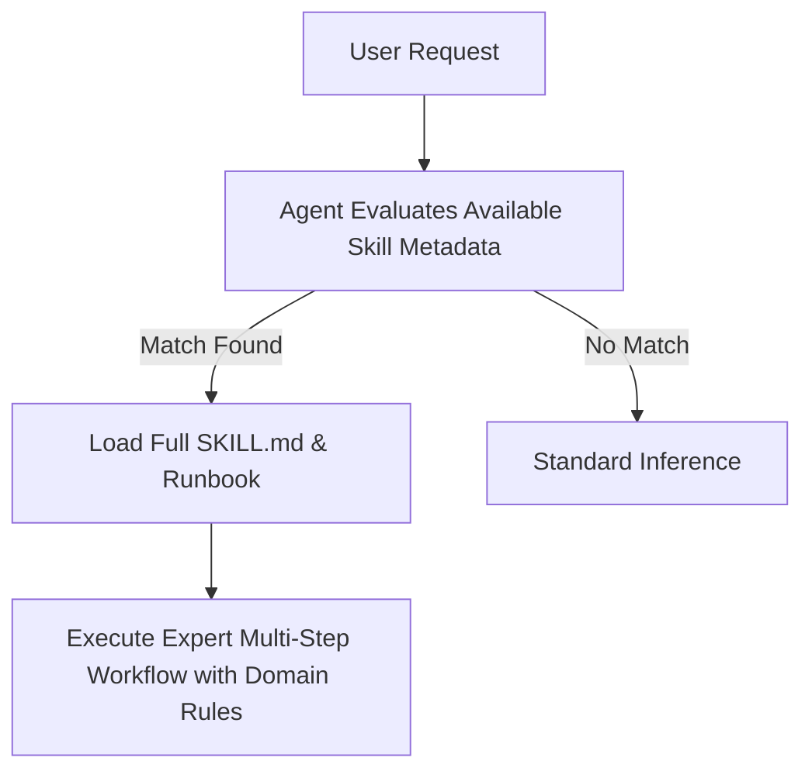

# 🧠 Agent Skills

A curated repository of production-grade, enterprise-ready **Agent Skills** designed for AI coding assistants and autonomous agents (including Google Antigravity, Gemini CLI, Claude Code, and Agentic IDEs).

Agent skills act as modular on-demand runbooks and domain knowledge packs. They equip agents with battle-tested architectures, best practices, security guardrails, and design systems without bloating prompt context windows.

---

## 📑 Table of Contents

- [Overview](#-overview)
- [Skills Catalog](#-skills-catalog)
  - [🎨 Frontend & UI/UX Design](#-frontend--uiux-design)
  - [⚙️ Backend & Cloud Architecture](#️-backend--cloud-architecture)
  - [🤖 AI & Data Systems](#-ai--data-systems)
  - [🧪 QA & Reliability Engineering](#-qa--reliability-engineering)
  - [🎮 Game Architecture](#-game-architecture)
  - [🛠️ Templates & Testing](#️-templates--testing)
- [Quick Start & Installation](#-quick-start--installation)
  - [Option 1: Using the Automated Installer (Recommended)](#option-1-using-the-automated-installer-recommended)
  - [Option 2: Direct Global Installation](#option-2-direct-global-installation)
  - [Option 3: Project-Level Installation](#option-3-project-level-installation)
- [How Agent Skills Work](#-how-agent-skills-work)
- [Creating & Contributing New Skills](#-creating--contributing-new-skills)
- [Repository Structure](#-repository-structure)

---

## 🚀 Overview

Skills use **progressive disclosure**. The agent only ingests the `name` and `description` frontmatter initially, loading the full skill instructions only when a relevant user prompt requires it. This keeps inference costs low and reasoning sharp.



---

## 📚 Skills Catalog

### 🎨 Frontend & UI/UX Design

| Skill Name | Purpose & Activation Scenarios | Location |
| :--- | :--- | :--- |
| [`frontend-design-mastery`](./skills/frontend-design-mastery/SKILL.md) | World-class frontend UI/UX design principles, responsive layout rules, typography hierarchies, and premium styling guidelines for modern web applications. | [skills/frontend-design-mastery](./skills/frontend-design-mastery/) |
| [`frontend-design`](./skills/frontend-design/SKILL.md) | Enterprise UI/UX design direction, component layout structures, visual hierarchy rules, color composition, and modern aesthetic guidelines. | [skills/frontend-design](./skills/frontend-design/) |
| [`design-taste-frontend`](./skills/design-taste-frontend/SKILL.md) | High-taste aesthetic guidelines, typography pairing, glassmorphic elevation, and visual polish rules from agentic-awesome-skills. | [skills/design-taste-frontend](./skills/design-taste-frontend/) |
| [`react-best-practices`](./skills/react-best-practices/SKILL.md) | Production-grade React 18 component patterns, hooks optimization, lazy-loading, suspense boundaries, and DOM sanitization. | [skills/react-best-practices](./skills/react-best-practices/) |
| [`tailwind-patterns`](./skills/tailwind-patterns/SKILL.md) | Best practices for composing maintainable, responsive, high-performance Tailwind CSS utility classes and design tokens. | [skills/tailwind-patterns](./skills/tailwind-patterns/) |

### ⚙️ Backend & Cloud Architecture

| Skill Name | Purpose & Activation Scenarios | Location |
| :--- | :--- | :--- |
| [`nodejs-backend-architecture`](./skills/nodejs-backend-architecture/SKILL.md) | Enterprise Node.js and Express backend architecture, asynchronous hot-path optimizations, memory leak prevention, and resilient connection pooling. | [skills/nodejs-backend-architecture](./skills/nodejs-backend-architecture/) |
| [`cloud-keepalive-resilience`](./skills/cloud-keepalive-resilience/SKILL.md) | Enterprise-grade keep-alive, database warming, and cold-start absorption patterns for free-tier and serverless cloud services (Render, Supabase, Fly.io, Vercel, Railway, Neon). Includes automated cron workflows and ping scripts. | [skills/cloud-keepalive-resilience](./skills/cloud-keepalive-resilience/) |
| [`security-audit-hardening`](./skills/security-audit-hardening/SKILL.md) | Enterprise application security hardening, Content Security Policy (CSP), magic-byte file signature validation, rate limiting, and zero-trust sanitization. | [skills/security-audit-hardening](./skills/security-audit-hardening/) |

### 🤖 AI & Data Systems

| Skill Name | Purpose & Activation Scenarios | Location |
| :--- | :--- | :--- |
| [`rag-system-architect`](./skills/rag-system-architect/SKILL.md) | Hybrid retrieval-augmented generation (RAG), dense vector similarity search, Reciprocal Rank Fusion (RRF), chunking strategies, and SHA-256 embedding cache patterns. | [skills/rag-system-architect](./skills/rag-system-architect/) |

### 🧪 QA & Reliability Engineering

| Skill Name | Purpose & Activation Scenarios | Location |
| :--- | :--- | :--- |
| [`automated-testing-patterns`](./skills/automated-testing-patterns/SKILL.md) | Enterprise QA test harness engineering, chaos testing, load simulation, financial precision assertion, and regression suite architecture. | [skills/automated-testing-patterns](./skills/automated-testing-patterns/) |

### 🎮 Game Architecture

| Skill Name | Purpose & Activation Scenarios | Location |
| :--- | :--- | :--- |
| [`platformer-level-design`](./skills/platformer-level-design/SKILL.md) | Master 2D/2.5D platformer level design architecture based on Kishōtenketsu, GMTK, Celeste, and Mario spatial traversal loops. | [skills/platformer-level-design](./skills/platformer-level-design/) |

### 🛠️ Templates & Testing

| Skill Name | Purpose & Activation Scenarios | Location |
| :--- | :--- | :--- |
| [`_template`](./skills/_template/SKILL.md) | Starter blueprint for authoring new agent skills with standardized YAML frontmatter and validation sections. | [skills/_template](./skills/_template/) |
| [`test-skill`](./skills/test-skill/SKILL.md) | Lightweight skill for verifying global and project-level skill discovery. | [skills/test-skill](./skills/test-skill/) |

---

## ⚡ Quick Start & Installation

Clone this repository:

```bash
git clone https://github.com/SHEMMY01-web/agent-skills.git
cd agent-skills
```

### Option 1: Using the Automated Installer (Recommended)

The included `install.sh` script automates installation across global and workspace configurations:

```bash
# 1. Inspect all available skills
./install.sh --list

# 2. Install all skills globally for all agent sessions
./install.sh --global

# 3. Or create live symlinks (updates in this repo immediately reflect globally)
./install.sh --link-global

# 4. Or install skills into a specific project workspace
./install.sh --project /path/to/your/project
```

### Option 2: Direct Global Installation

To make these skills available across **every project** on your machine:

```bash
mkdir -p ~/.gemini/config/skills
cp -r skills/* ~/.gemini/config/skills/
```

### Option 3: Project-Level Installation

To equip a specific repository or project:

```bash
mkdir -p /path/to/your/project/.agents/skills
cp -r skills/* /path/to/your/project/.agents/skills/
```

---

## 🧩 How Agent Skills Work

Every skill directory adheres to the standard Agent Customization schema:

```text
skills/<skill-name>/
├── SKILL.md          # Required: Instructions with YAML frontmatter
├── scripts/          # Optional: Helper utilities and automated scripts
├── examples/         # Optional: Reference implementations and code samples
└── references/       # Optional: In-depth documentation and whitepapers
```

### The `SKILL.md` Specification
Every `SKILL.md` requires YAML frontmatter specifying:
- `name`: Lowercase, hyphenated unique skill identifier.
- `description`: Explicit guidance stating **what** the skill achieves and **under what exact conditions** the agent should activate it.

Example:
```yaml
---
name: security-audit-hardening
description: >-
  Enterprise application security hardening, Content Security Policy (CSP),
  magic-byte file validation, rate limiting, and zero-trust data sanitization.
---
```

---

## ✍️ Creating & Contributing New Skills

1. Duplicate the template:
   ```bash
   cp -r skills/_template skills/my-new-skill
   ```
2. Edit `skills/my-new-skill/SKILL.md` and define the YAML frontmatter and runbook.
3. If necessary, add scripts to `scripts/` or examples to `examples/`.
4. Test discovery using `./install.sh --list`.
5. Commit and push your changes!

---

## 📂 Repository Structure

```text
agent-skills/
├── .agents/
│   └── skills -> ../skills     # Workspace symlink for instant IDE discovery
├── skills/                     # Canonical skill definitions
│   ├── automated-testing-patterns/
│   ├── cloud-keepalive-resilience/
│   │   ├── examples/
│   │   └── scripts/
│   ├── design-taste-frontend/
│   ├── frontend-design/
│   ├── frontend-design-mastery/
│   ├── nodejs-backend-architecture/
│   ├── platformer-level-design/
│   ├── rag-system-architect/
│   ├── react-best-practices/
│   ├── security-audit-hardening/
│   ├── tailwind-patterns/
│   ├── test-skill/
│   └── _template/
├── install.sh                  # One-click installation & linking utility
└── README.md                   # Documentation catalog
```

---

## 📄 License

MIT © [SEMILORE](https://github.com/SHEMMY01-web)
